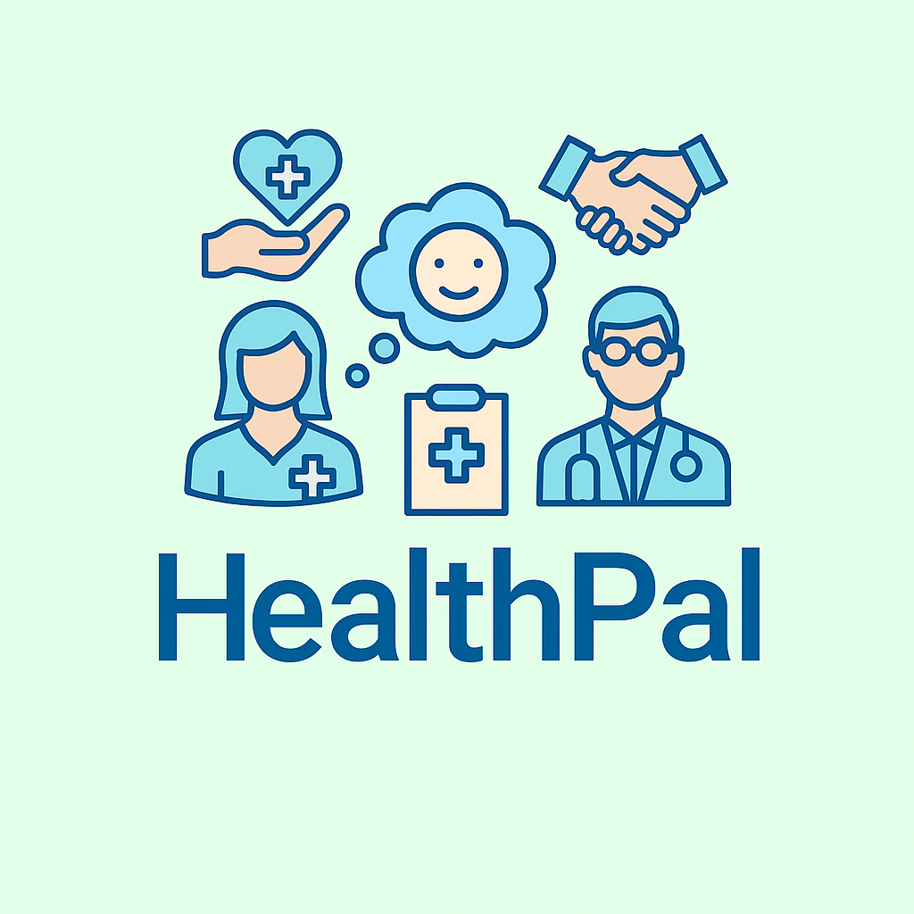

# HealthPal

<div>
  <p align="center">
    
  </p>

  <h3 align="center">HealthPal</h3>

  <p align="center">
    A unified healthcare management ecosystem that connects patients, doctors, NGOs, donors, and service providers through a secure and intuitive digital platform.
    <br />
    <a href="https://github.com/danahamdanx/HealthPal/wiki"><strong>Explore the docs »</strong></a>
    <br /><br />
  </p>
</div>

<p>
<strong>HealthPal</strong> is a complete healthcare coordination system built to simplify and automate medical assistance workflows. It integrates patient care, doctor consultations, NGO case management, donation tracking, medical equipment requests, health education, and public safety alerts into one platform. 
</p>

<p>
Backed by a robust PostgreSQL schema, HealthPal ensures secure authentication, role-based access, real-time tracking, automated reporting, NGO analytics, and PDF-generated summaries and prescriptions.
</p>

## GitHub Repository Information :small_blue_diamond:

<p>
  :file_folder: <a href="https://github.com/danahamdanx/HealthPal"></a> &nbsp;
  :open_file_folder: <a href="https://github.com/danahamdanx/HealthPal"></a> &nbsp;
  :date: <a href="https://github.com/danahamdanx/HealthPal"></a> &nbsp;
  :busts_in_silhouette: <a href="https://github.com/danahamdanx/HealthPal"></a> &nbsp;
</p>

# Table of Contents ℹ️

- [HealthPal](#healthpal)
- [Core Features](#core-features)
- [Extra Features](#extra-features)
- [Technologies Used](#technologies-used)
- [External APIs Used](#external-apis-used)
- [External Libraries and Packages](#external-libraries-and-packages)
- [Installation](#installation)

## Core Features ⭐

<ol>
  <li><strong>User & Role Management</strong><br/>
      Secure authentication with hashed credentials and JWT-based role control for:
      Admins, Doctors, Patients, NGOs, and Donors.
  </li>

  <li><strong>Patient & Doctor Profiles</strong><br/>
      Comprehensive patient medical histories, demographic info, and clinical notes.
      Doctors maintain specialties, availability, licenses, and professional experience.
  </li>

  <li><strong>Consultations</strong><br/>
      Patients schedule sessions with doctors, with support for translations, diagnoses, treatments,
      and structured clinical notes stored directly in the database.
  </li>

  <li><strong>Therapy Sessions</strong><br/>
      Session tracking with duration, focused topics, initial concerns, progress summaries,
      recurring appointments, and doctor–patient follow-up.
  </li>

  <li><strong>NGO Case Management</strong><br/>
      NGOs manage medical cases, verify details, update case progress, and track raised vs. targeted amounts.
  </li>

  <li><strong>Donation System</strong><br/>
      Donors contribute to cases, view contribution history, and track progress.
      Monthly summaries and case-level financial analytics are generated for transparency.
  </li>

  <li><strong>Medical Requests</strong><br/>
      Patients submit medical supply requests with urgency levels.
      NGOs or donors can claim requests and update their status through the lifecycle.
  </li>

  <li><strong>Equipment Inventory & Lending</strong><br/>
      Add, categorize, and track medical equipment.
      Patients can request equipment, while NGOs/Donors can review, approve, or claim requests.
  </li>

  <li><strong>Workshops & Health Education</strong><br/>
      Host health workshops, manage attendees, and track registrations.
  </li>

  <li><strong>Health Guides & Articles</strong><br/>
      Publish categorized health content in different languages with images and metadata.
  </li>

  <li><strong>Public Health Alerts</strong><br/>
      Issue alerts with severity levels, regions, expiration dates, and emergency classifications.
  </li>

  <li><strong>Support Tickets (NGO Complaints)</strong><br/>
      NGOs can submit complaints or support inquiries with tracking and follow-up by administrators.
  </li>

  <li><strong>Audit Logs</strong><br/>
      Every user action is logged with a status code, message, and timestamp for full traceability.
  </li>
</ol>

## Extra Features⭐⭐

<ul>
 <li><strong>Role Dashboard</strong><br/>

<strong>Patient Dashboard</strong>
Displays essential patient activity such as upcoming consultations, therapy sessions, recent cases, medical requests, and equipment requests.
<strong>Doctor Dashboard</strong>
Shows the doctor’s daily schedule including today’s consultations, therapy sessions, and recently attended patients.
<strong>NGO Dashboard</strong>
Provides case statistics, total donations received, active/closed case counts, and request claim activity.
<strong>Donor Dashboard</strong>
Summarizes donor activity including total donations, supported cases, and recent contribution history.

</li>

 <li><strong>Reporting & Analytics (API)</strong><br/>
Monthly donation summary (per donor, NGO, or full platform)
Top NGO-managed cases based on activity or donations
Medical requests sorted by priority levels
Case progress and status summaries
</li>

 <li><strong>PDF Generation</strong><br/>
  Consultation report PDFs including diagnosis, notes, and treatment
  Prescription PDFs generated and signed by doctors
  Donation receipt PDFs automatically generated and sent to donors
</li>

  <li><strong>Email Notifications</strong><br/>
      Automated reminders for consultations, therapy sessions, medical request updates,
      donation confirmations, and equipment claims.
  </li>

  <li><strong>Session & Activity Tracking</strong><br/>
      Detailed logs for system monitoring and debugging.
  </li>

  <li><strong>Token Blacklisting</strong><br/>
      Secure logout and revoked token handling through a blacklist table.
  </li>

  <li><strong>Role-Based Data Access</strong><br/>
      Each role has filtered and secure access to their own domain-specific data.
  </li>
</>

## Technologies Used⚙


## External APIs Used📌

<ul>
  <li><strong>WHO RSS Feed</strong><br/>
      Retrieves the latest global health articles and advisories for storage and presentation within HealthPal.</li>

  <li><strong>CDC Media API</strong><br/>
      <code>https://tools.cdc.gov/api/v2/resources/media</code><br/>
      Fetches verified health content, public safety guidance, and disease updates for integration into the Health Guides and Alerts modules.</li>
</ul>

## External Libraries and Packages📦

- **bcrypt**: Password encryption and secure authentication.
- **jsonwebtoken (jwt)**: Secure token generation for authentication and role-based access.
- **express**: Server framework for routing and HTTP handling.
- **express-session**: Session management for user activities.
- **node-cron**: Schedule notifications and automated tasks.
- **axios**: HTTP requests to external APIs.
- **moment**: Format dates and timestamps.
- **puppeteer**: Generate PDF invoices for donations or case summaries.
- **nodemailer**: Send email notifications for appointments, donations, and alerts.

## Installation

1. Clone the repository:
   ```bash
   git clone [https://github.com/username/project-name.git]
   ```
2. Navigate to the project directory:
   ```bash
   cd healthpal
   ```
3. Install dependencies:
   ```bash
   npm install
   ```
4. Run the application:
   ```bash
   npx nodemon server.js
   ```
